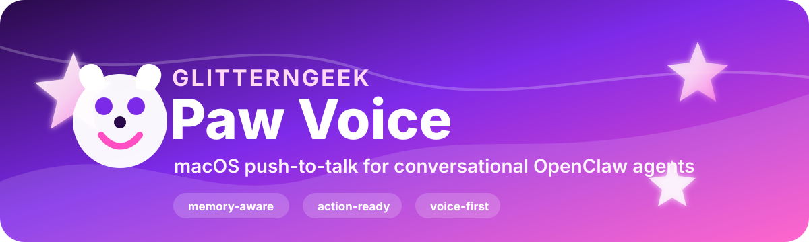

<p align="center">
  
</p>

<p align="center">
  
  
  
</p>

# ✨ Paw Voice V1

Paw Voice is an experimental macOS push-to-talk voice interface for OpenClaw, built to make a personal OpenClaw agent feel conversational, memory-aware, and action-capable.

It records a short spoken request, transcribes it, routes it into OpenClaw, and speaks the reply back. V1 is intentionally scoped: it is a developer-friendly macOS voice layer for people already using, or willing to install, OpenClaw.

Built with GlitterNGeek energy: warm, beginner-safe, technically useful, and just sparkly enough to feel alive. 💜💖🤍

## 🌟 Status

Paw Voice V1 is usable, cloneable, and documented, but still experimental.

### ✅ V1 Includes

- 🪄 One-command macOS installer.
- 🎙️ Global Control+Space push-to-talk.
- ✨ Native macOS recorder with speech/silence auto-stop.
- 🧠 Deepgram `nova-3` STT by default, with local Whisper and OpenAI STT options.
- 💬 ElevenLabs spoken replies by default, with macOS speech as a no-key fallback.
- 🧵 Sticky voice session by default: `agent:main:voice`.
- 🧪 Disposable diagnostic sessions: `--target fresh`.
- 🚦 Explicit main-session handoff: `--target main`.
- 📚 Long-task handoff lane for docs, research, implementation, summaries, and memory work.
- 🗒️ Voice task status, cancel, and readback commands.
- ⚡ Fast local handling for status, time, date, math, and quick checks.
- 🛡️ Busy lock, timeout handling, doctor checks, and generated-audio E2E testing.
- 📦 Source release packaging script.

### 🔮 V2 Targets

- 🗣️ Voice Wake / continuous talk mode.
- 🌎 Cross-platform recording beyond macOS.
- 🍬 Packaged signed app distribution.
- 🧭 Friendlier first-run setup UI.
- 🎛️ More provider adapters for STT/TTS.

## 💎 How Paw Voice Uses OpenClaw

Paw Voice is not a replacement for OpenClaw. OpenClaw is the assistant platform: agents, sessions, tools, skills, memory, gateway, channels, and research. Paw Voice is a local voice surface that sends spoken intent into that platform.

Common flows:

- 🕒 “What time would it be 9 hours from now?” uses a fast local cognitive command when possible.
- 🧠 “Remember this for later…” routes into the sticky voice session, where your OpenClaw agent can decide what belongs in durable memory.
- 🔎 “Research this…” or “write up documentation…” can be handed to the long-task voice lane so the spoken request does not die inside a short reply timeout.
- 🚀 “Send this to main…” hands work to `agent:main:main` without making every spoken turn pollute the typed session.
- 🧼 “Reset voice context” clears the sticky voice session when a bad transcript or stale context gets in the way.

## 🧰 Requirements

- macOS 13 or newer.
- Node.js 20 or newer, Node 22 recommended.
- OpenClaw CLI installed, authenticated, and available as `openclaw` on `PATH`.
- `ffmpeg` for recording/transcription workflows.
- macOS command line tools with `swiftc`, `plutil`, `codesign`, and `launchctl`.
- Optional: local Whisper CLI for offline STT.
- Optional: Go, only if rebuilding or testing `tools/paw-stt-go`.
- Optional: `sag` for ElevenLabs speech helpers.

OpenClaw setup starts here:

```bash
npm install -g openclaw@latest
openclaw onboard --install-daemon
```

Then verify:

```bash
openclaw gateway status
openclaw agent --message "Reply with exactly: OK"
```

## 🔐 Secrets

Do not commit secrets. Use environment variables or local key files.

Supported environment variables:

```bash
export ELEVENLABS_API_KEY="..."
export DEEPGRAM_API_KEY="..."
export OPENAI_API_KEY="..."
```

Preferred local key files:

```bash
mkdir -p ~/.openclaw/secrets
printf '%s' 'YOUR_ELEVENLABS_KEY' > ~/.openclaw/secrets/elevenlabs-api-key
printf '%s' 'YOUR_DEEPGRAM_KEY' > ~/.openclaw/secrets/deepgram-api-key
printf '%s' 'YOUR_OPENAI_KEY' > ~/.openclaw/secrets/openai-api-key
chmod 600 ~/.openclaw/secrets/*-api-key
```

If you do not have ElevenLabs yet, install with macOS speech:

```bash
node tools/install-paw-voice.mjs --speech-mode macos
```

## ⚡ Quick Install

Clone the repo:

```bash
git clone <your-repo-url>
cd <repo>
```

Install Paw Voice:

```bash
node tools/install-paw-voice.mjs
```

Use macOS speech instead of ElevenLabs:

```bash
node tools/install-paw-voice.mjs --speech-mode macos
```

The installer builds the native recorder app, installs the Control+Space LaunchAgent, and runs the doctor status check.

## 👋 First Thing To Try

After install, press Control+Space and introduce yourself:

> “Hi Paw, my name is Maya.”

Paw should greet you by first name and introduce its GlitterNGeek roots with a little personality:

> “Hi, Maya. Nice to meet you. I was created by Vic, founder of GlitterNGeek, and my tiny digital paws are ready. What do you need?”

The exact greeting may vary because Paw keeps a few cute, witty intro lines in rotation. After that, Paw stores the current speaker name in local voice runtime state so follow-up voice turns can refer to that person instead of assuming every speaker is Vic.

Try a quick check:

> “What’s my name?”

## 🛠️ Manual Setup

If you want to run each step yourself:

```bash
export OPENCLAW_WORKSPACE="$PWD"
export OPENCLAW_BIN="$(command -v openclaw)"

node tools/build-paw-push-to-talk-app.mjs
node tools/install-paw-hotkey-listener.mjs install --mode normal --target voice --speech-mode elevenlabs
node tools/paw-voice-doctor.mjs status
```

Uninstall the hotkey listener:

```bash
node tools/install-paw-hotkey-listener.mjs uninstall
```

## 🎙️ Usage

Press Control+Space, speak, then pause. Paw records until silence or the configured max duration, sends the transcript to OpenClaw, and speaks the reply.

Manual CLI run:

```bash
node tools/paw-push-to-talk.mjs --mode normal --target voice
```

Use a saved audio file:

```bash
node tools/paw-push-to-talk.mjs --file request.wav --target voice --json
```

Diagnostics:

```bash
node tools/paw-voice-doctor.mjs status
node tools/paw-voice-doctor.mjs checkup
node tools/paw-voice-doctor.mjs e2e-generated-audio
node tools/paw-voice-doctor.mjs last-run
```

Create a source release archive:

```bash
node tools/package-paw-voice-release.mjs
```

The archive is written under `dist/` and excludes generated apps, runtime state, secrets, memory, and audio.

## 💬 Voice Commands To Try

- 👋 “Hi Paw, my name is Maya.”
- 💅 “Call me Jordan.”
- 🪞 “What’s my name?”
- 🕒 “What time would it be 9 hours from now?”
- 💎 “Remember this voice test word: sapphire.”
- 🧠 “What word did I just ask you to remember?”
- 🧼 “Reset voice context.”
- 🚀 “Send to main: summarize the current voice setup.”
- 📚 “Write up documentation for this project.”
- 🗒️ “What voice tasks are running?”
- 🔁 “Read back the last voice task.”
- 🛑 “Cancel the current voice task.”

## 🚦 Routing

- `--target voice`: sticky reusable voice lane, default.
- `--target fresh`: disposable session for tests and risky commands.
- `--target main`: send the request to the main OpenClaw session.
- `--target SESSION_KEY`: send to a specific OpenClaw session key.

## 🎛️ Speech And Recording Modes

Speech modes:

- `--speech-mode elevenlabs`: higher quality TTS, requires ElevenLabs key.
- `--speech-mode macos`: local macOS speech, no TTS API key.

Recording modes:

- `quick`: shorter recording window and faster local model defaults.
- `normal`: everyday push-to-talk mode.
- `dictation`: longer recording window.

## ⚙️ Configuration

Common environment variables:

```bash
export PAW_PUSH_TO_TALK_TARGET="voice"
export PAW_PUSH_TO_TALK_STT_PROVIDER="deepgram"
export PAW_PUSH_TO_TALK_STT_MODEL="nova-3"
export PAW_PUSH_TO_TALK_SPEECH_MODE="elevenlabs"
export PAW_PUSH_TO_TALK_AGENT_TIMEOUT="45"
export PAW_PUSH_TO_TALK_VOICE_MAX_WORDS="18"
export PAW_PUSH_TO_TALK_INSTANT_ACK="1"
export PAW_PUSH_TO_TALK_LEAN_COMMANDS="1"
export PAW_PUSH_TO_TALK_FAST_REPLY="1"
```

Launcher/build customization:

```bash
export OPENCLAW_WORKSPACE="$PWD"
export OPENCLAW_BIN="$(command -v openclaw)"
export PAW_NODE_BIN="$(command -v node)"
export PAW_HOTKEY_LABEL="dev.example.paw.push-to-talk.hotkey"
export PAW_NATIVE_BUNDLE_ID="dev.example.paw.push-to-talk.native"
```

## 🛡️ Privacy And Git Hygiene

This repo should not include API keys, transcripts, generated audio, runtime state, personal memory, or local workspace identity files. The included `.gitignore` excludes the usual danger zones:

- `.openclaw/`
- `memory/`
- `MEMORY.md`
- local persona/workspace files
- `.env*`
- `secrets/`
- generated `.app` bundles
- audio files
- local STT binaries
- `dist/`

Before pushing:

```bash
git status --short
rg -n "sk-|ELEVENLABS_API_KEY|DEEPGRAM_API_KEY|OPENAI_API_KEY|/Users/" .
```

Review any match before committing.

## 🚧 Product Boundaries

Paw Voice V1 is a macOS push-to-talk interface. It does not yet include Voice Wake, continuous conversation, cross-platform recording, or a signed packaged app. Those are V2/productization tracks, not V1 promises.

---

<p align="center">
  <strong>Made for GlitterNGeek-style builders: practical magic, clear systems, and beginner-safe AI. ✨</strong>
</p>
